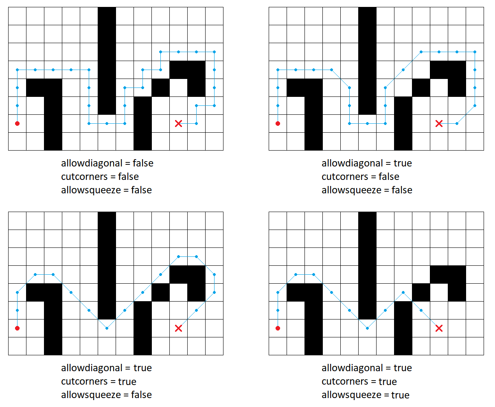

# PathPlanningProject

[](https://travis-ci.org/maksim1744/PathPlanningProject)
[](https://ci.appveyor.com/project/maksim1744/pathplanningproject/branch/master)

## О программе
Программа позволяет искать путь между двумя точками на клеточной карте с помощью алгоритмов Djikstra или A\*. На вход программе подается файл формата `.xml` с необходимыми тегами, на выходе также получается файл `.xml`.

## Формат данных 
Примеры входных и выходных файлов можно посмотреть в папке `Examples`

Входной файл содержится в теге `root`, в котором расположены следующие теги:
+ `map` &mdash; обязательный тег, содержащий основную информацию о задаче
    + `width`, `height` &mdash; размеры карты
    + `cellsize` &mdash; размер одной клетки
    + `startx`, `starty` &mdash; координаты начальной клетки
    + `finishx`, `finishy` &mdash; координаты конечной клетки
    + `grid` &mdash; содержит поле: `height` тегов `row`, в каждом из которых `width` нулей или единиц через пробел, причем нули означают свободную клетку, а единицы &mdash; занятую
+ `algorithm`
    + `searchtype` &mdash; алгоритм поиска: `astar` или `dijkstra`
    + `metrictype` &mdash; эвристика для оценки расстояния (`x`, `y` &mdash; расстояние до цели по горизонтали и вертикали соответственно)
        + `euclidean` &mdash; `sqrt(x * x + y * y)`
        + `manhattan` &mdash; `abs(x) + abs(y)`
        + `chebyshev` &mdash; `max(abs(x), abs(y))`
        + `diagonal` &mdash; `min(x, y) * (sqrt(2) - 1) + max(x, y)`
    + `breakingties` &mdash; определяет порядок раскрытия вершин при равенстве значения `f`: `g-min` или `g-max`
    + `hweight` &mdash; вес эвристики при подсчете `f` вершины
    + `allowdiagonal` &mdash; разрешено ли ходить по диагонали: `true` или `false`
    + `cutcorners` &mdash; разрешено ли ходить по диагонали, если с одной стороны стена: `true` или `false`
    + `allowsqueeze` &mdash; разрешено ли ходить по диагонали, если с обеих сторон стены: `true` или `false`
    
+ `options`
    + `loglevel` &mdash; уровень логирования, каждый следующий включает всю информацию предыдущего
        + `0` &mdash; ничего
        + `0.5` &mdash; только тег `summary` (подробнее в формате выходного файла)
        + `1` &mdash; путь на поле и в форматах `hplevel` и `lplevel`
        + `1.5` &mdash; тег `lowlevel`, в который записываются списки `OPEN` и `CLOSED` в конце работы алгоритма
        + `2` &mdash; в тег `lowlevel` списки `OPEN` и `CLOSED` записываются на каждом шаге алгоритма
    + `logpath`
    + `logfilename`

Выходной файл содержит всю информацию из входного файла, а также следующие теги (в зависимости от уровня логирования):
+ `mapfilename` &mdash; имя входного файла
+ `summary` &mdash; содержит следующие параметры
    + `numberofsteps` &mdash; количество итераций алгоритма
    + `nodecreated` &mdash; количество созданных нод
    + `length` &mdash; длина пути в клетках
    + `length_scaled` &mdash; длина пути, умноженная на `cellsize`
    + `time` &mdash; время работы алгоритма в секундах
+ `path` &mdash; тег, содержащий поле в том же формате, что и `grid`, но клетки на пути помечены символом `*`
+ `lplevel` &mdash; путь в формате списка тегов `node`, каждый из которых содержит параметры `x`, `y` и `number` &mdash; координаты клетки пути и номер клетки в пути.
+ `hplevel` &mdash; содержит путь в сжатом формате: список тегов `section` с параметрами `number`, `start.x`, `start.y`, `finish.x`, `finish.y`, где `number` означает номер отрезка пути, а остальные параметры &mdash; координаты начала и конца соответствующего прямого отрезка пути
+ `lowlevel` --- набор тегов `step` с параметрами `number`, в каждом содержатся теги `open` и `closed`, в каждом из которых набор тегов `node`. Тег `node` имеет параметры `x`, `y`, `F`, `g`, `parent_x`, `parent_y` --- координаты ноды, функции `f` и `g` для ноды и ее предок.


    ## Сборка и запуск

    Сборку проекта возможно осуществить двумя способами:
    - Используя QtCreator и qmake;
    - Используя CMake.
      
    При использовании QtCreator требуется открыть файл `ASearch.pro` который находится в директории `.../PathPlanningProject/Src/` и настроить проект с нужным комплектом сборки.

    

    После выбора проекта требуется установить имя входного файла как аргумент командной строки. В качестве первого примера используйте файл `.../PathPlanningProject/Examples/example.xml`. Для установки аргументов командной строки перейдите в настройки запуска проекта и введите нужный путь к файлу в поле "Параметры командной строки".

    

    При использовании CMake сборка и запуск может производиться как из командной строки, так и при помощи различных IDE (например JetBrains CLion). Ниже приведены скрипты сборки и запуска с использованием командной строки.

    ### Linux и Mac
    Release сборка:
    ```bash
    cd PathPlanningProject
    cd Build
    cd Release
    cmake ../../ -DCMAKE_BUILD_TYPE="Release"
    make
    make install
    ```

    Debug сборка:
    ```bash
    cd PathPlanningProject
    cd Build
    cd Debug
    cmake ../../ -DCMAKE_BUILD_TYPE="Debug"
    make
    make install
    ```

    Запуск:
    ```bash
    cd ../../Bin/{Debug|Release}/
    ./PathPlanning ../../Examples/example.xml
    ```
    ### Windows
    Release сборка:
    ```cmd
    cd PathPlanningProject
    cd Build
    cd Release
    set PATH
    cmake ../../ -DCMAKE_BUILD_TYPE="Release" -G "MinGW Makefiles"
    mingw32-make
    mingw32-make install
    ```

    Debug сборка:
    ```cmd
    cd PathPlanningProject
    cd Build
    cd Debug
    set PATH
    cmake ../../ -DCMAKE_BUILD_TYPE="Debug" -G "MinGW Makefiles"
    mingw32-make
    mingw32-make install
    ```

    Запуск:
    ```cmd
    cd ../../Bin/{Debug|Release}/
    PathPlanning.exe ../../Examples/example.xml
    ```
